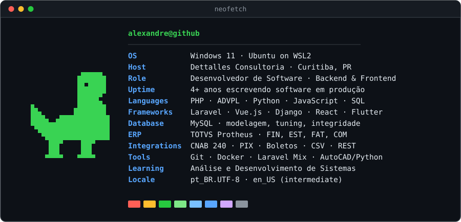

<div align="center">
  
</div>

<div align="center">

  <a href="https://alexandrequintiliano.com.br"></a>
  <a href="https://www.linkedin.com/in/alexandrequintiliano/"></a>

</div>

---

<details open>
<summary><b>&nbsp;🇧🇷&nbsp; Português</b></summary>
<br>

Desenvolvedor de software com base em **backend** e passagens firmes pelo **frontend**. Trabalho na fronteira onde regra de negócio vira código: ERP **TOTVS Protheus** em ADVPL, **integrações bancárias** (CNAB 240, PIX, boletos), sustentação de bases legadas e portais web em **Laravel + Vue**.

Antes de programar, me formei em Administração. Isso mudou como eu leio um sistema: não recebo um chamado, recebo um processo quebrado — e quase sempre a correção certa está na regra, não no código. Diagnosticar incidente em produção, homologar e entregar sem parar a operação virou rotina.

Hoje curso **Análise e Desenvolvimento de Sistemas** na Uninter, com conclusão prevista para Dezembro de 2026.

</details>

<details>
<summary><b>&nbsp;🇺🇸&nbsp; English</b></summary>
<br>

Software developer rooted in **backend**, with solid time spent on the **frontend**. I work where business rules turn into code: **TOTVS Protheus** ERP in ADVPL, **banking integrations** (CNAB 240, PIX, bank slips), legacy system maintenance, and web portals in **Laravel + Vue**.

I earned a Business Administration degree before I started programming. It changed how I read a system: I don't get a ticket, I get a broken process — and more often than not the right fix lives in the rule, not in the code. Diagnosing production incidents, validating them in staging and shipping without stopping operations is routine.

I'm currently studying **Systems Analysis and Development** at Uninter, graduating December 2026.

</details>

<br>

<div align="center">
  
</div>

## `$ ls -la ~/stack`

```
alexandre/
├── backend/        PHP · Laravel · Python · Django
├── erp/            TOTVS Protheus · ADVPL — financeiro, estoque, faturamento, compras
├── integracoes/    CNAB 240 · PIX · boletos · importação CSV · portal ↔ ERP
├── frontend/       Vue.js (Inertia, Vuetify) · React · JavaScript
├── mobile/         Flutter
├── dados/          MySQL — modelagem, otimização de consultas, integridade referencial
└── ferramentas/    Git · Docker · Laravel Mix · automação de AutoCAD com Python
```

## `$ git log --author="alexandre" --oneline`

```
mai/2026 → hoje       Dettalles Consultoria   Protheus/ADVPL · Laravel + Vue · CNAB 240, PIX, boletos Itaú
abr/2025 → abr/2026   Preâmbulo Tech          PHP · MySQL · sustentação de legado (PHP 5.3) · integrações
mar/2022 → jun/2024   A1 Engenharia           Django · Flutter · automação de AutoCAD em Python
```

## `$ ./play`

<div align="center">

  <a href="https://alexandrequintiliano95.github.io/alexandrequintiliano95/">
    
  </a>

  **[▶ Jogar o dino-run](https://alexandrequintiliano95.github.io/alexandrequintiliano95/)** &nbsp;·&nbsp; canvas puro, zero dependências, [código aqui](./docs)

</div>

Escrevi o clone do dinossauro do Chrome do zero: física de pulo com salto curto controlável, pterodátilos, ciclo dia/noite e recorde salvo no navegador. Os sprites vivem em [`docs/sprites.js`](./docs/sprites.js) e são os **mesmos** que desenham o dino aqui em cima — o README e o jogo compartilham o desenho, ninguém copiou pixel de ninguém.

## `$ cat contributions | snake`

<div align="center">
  <picture>
    <source media="(prefers-color-scheme: dark)" srcset="https://raw.githubusercontent.com/alexandrequintiliano95/alexandrequintiliano95/output/snake-dark.svg">
    <source media="(prefers-color-scheme: light)" srcset="https://raw.githubusercontent.com/alexandrequintiliano95/alexandrequintiliano95/output/snake-light.svg">
    
  </picture>
</div>

## `$ gh api --stats`

<div align="center">
  
</div>

<sub>Este card é gerado por uma Action deste repositório, direto da API do GitHub — não depende de nenhum serviço de terceiros para continuar no ar.</sub>

<!--
  PROJETOS EM DESTAQUE — descomente e troque <repo> pelo nome de cada repositório.
  Fica melhor com 2 ou 4 cards. Combine com os repositórios fixados no seu perfil.

<div align="center">
  <a href="https://github.com/alexandrequintiliano95/<repo>">
    &hide_border=true&bg_color=0d1117&title_color=39d353&icon_color=39d353&text_color=8b949e">
  </a>
</div>
-->

---

<div align="center">

```
$ contact --list
```

<a href="https://alexandrequintiliano.com.br">site</a> &nbsp;·&nbsp;
<a href="https://www.linkedin.com/in/alexandrequintiliano/">linkedin</a>

<br>

<sub>Aberto a conversar sobre backend, ERP e integrações. <i lang="en">Open to talk about backend, ERP and integrations.</i></sub>

<br><br>


</div>
